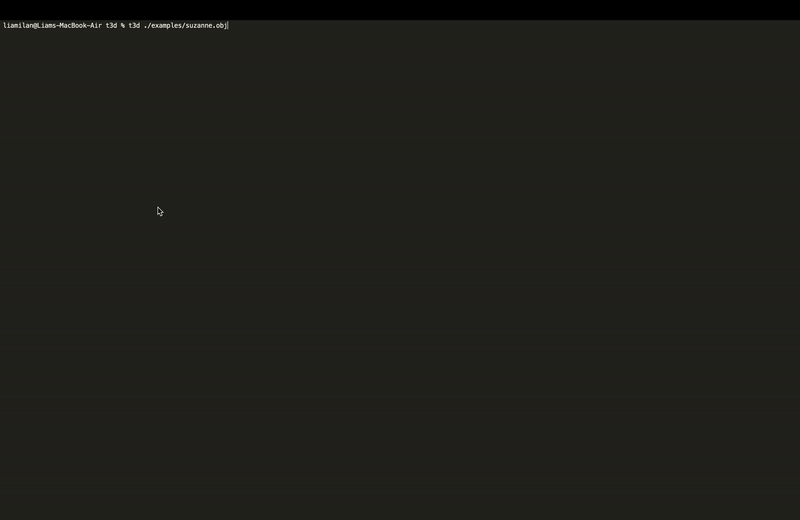

# Terminal3d
Terminal3d (`t3d`) is a tool for viewing 3d `.obj` files, right in your terminal! 🦀

---


*Suzanne the monkey - Find this example under [`examples/suzanne.obj`](./examples/suzanne.obj)*

---

## Features
- Reads any renders `.obj` file to the terminal.
- Render with both **braile** (`⡟`) and **block** (`▛`) charecters.
- Choose between wireframe and vertices modes.
- Use mouse controls to view your model, just like any other 3d software.

## Installation
Terminal3d is published as a crate on [crates.io](https://crates.io/crates/terminal3d). If you have Cargo, you can install it with:

```sh
cargo install terminal3d
```

The binary will automatically be added to your `PATH` as `t3d`. Run it with,
```sh
t3d <filepath.obj>
```

### Installing from Source
If you don't want to install a Rust crate, but do have Rust installed, you can build and run Terminal3d directly from source.

Clone this repository,
```sh
git clone https://github.com/liam-ilan/terminal3d.git
```

Navigate to the root of the repo directory, and run
```sh
cargo run --release <filepath.obj>
```

## Usage
```
t3d: Visualize .obj files in the terminal!

Usage:
    "t3d <filepath.obj>": Interactively view the provided .obj file.
    "t3d --h", "t3d --help", "t3d -h", "t3d -help", "t3d": Help and info.

Controls:
    Scroll down to zoom out, scroll up to zoom in.
    Click and drag the mouse to rotate around the model.
    Click and drag the mouse while holding [shift] to pan.

    Press [b] to toggle block mode. 
    Press [p] to toggle vertices mode. 
```
*Obtained from `t3d -h`*

## Author
(c) [Liam Ilan](https://www.liamilan.com/)